Here is the fully updated `doc/usage.md` file, incorporating the new architecture, the refined diagrams, and the correct user flows.

# Usage & Architecture

## High-Level Data Flow

The application follows a **Model-View-Service (MVS)** architecture designed for Streamlit's rerun cycle. Data flows from the "Liquid" state (User/AI input) into a "Brick" state (Polymorphic Entities) via a stable Service Layer.

```mermaid
graph RL
    %% Nodes
    User((User))
    YAML[("📂 dataset.yaml\n(Hard Drive)")]
    App["🖥️ Streamlit App\n(Session State)"]
    AI["🤖 Anthropic API\n(Claude Haiku)"]
    
    %% Flow
    YAML -- "1. Load Data" --> App
    App -- "2. Show Current View" --> User
    
    subgraph "The Triage Loop"
        App -- "3. Send Text + Context" --> AI
        AI -- "4. Return Classification" --> App
        App -- "5. Create Draft Proposal" --> User
        User -- "6. Confirm / Edit" --> App
    end
    
    App -- "7. Mutate Domain Model\n(Mark Dirty)" --> App
    User -- "8. Click Save" --> App
    App -- "9. Write to Disk" --> YAML

    %% Styling
    style YAML fill:#f9f,stroke:#333,stroke-width:2px
    style App fill:#bbf,stroke:#333,stroke-width:2px
    style AI fill:#bfb,stroke:#333,stroke-width:2px
```

---

## UI Layout & Navigation

### 1. The Sidebar (System Control)
The sidebar persists across all modes and handles the "Meta" application state.

*   **Dataset Selector:** A Dropdown menu listing files found in `./data/*.yaml`.
    *   *Options:* `home_renovation.yaml`, `coding_projects.yaml`, `test_edge_cases.yaml`.
*   **Status Indicator:**
    *   🟢 Saved
    *   🔴 Unsaved Changes (Dirty)
*   **Global Actions:**
    *   [Save Changes] (Enabled only when Dirty)
    *   [Reload/Revert] (Reloads from disk, discarding changes)

### 2. Main Content Area
Changes based on the selected Mode (Inbox / Planning / Engage).

---

## Architecture Diagrams

### 1. Class Diagram: The Polymorphic Stream
The core data structure uses a **Unified Stream** (`Project.items`) containing different types of items (`Task`, `Resource`, `Reference`).

### 2. Sequence Diagram: The Proposal Loop (Triage)
This flow shows how the AI suggests a "Draft," and the user confirms it to create a concrete entity.

### 3. Sequence Diagram: Explicit Persistence
This flow demonstrates the "Dirty Flag" pattern. Data is only written to disk when explicitly requested.

```mermaid
sequenceDiagram
    autonumber
    actor User
    participant UI as Sidebar
    participant Repo as Repository
    participant Disk as dataset.yaml

    %% 1. State Check
    Note over UI, Repo: User has made changes
    Repo-->>UI: is_dirty = True
    UI->>User: Show "🔴 Unsaved Changes"

    %% 2. Explicit Save
    User->>UI: Click "Save Changes"
    UI->>Repo: save()
    
    %% 3. Serialization
    Repo->>Repo: model_dump(mode='json')
    Repo->>Disk: Write YAML
    Repo->>Repo: is_dirty = False
    
    %% 4. Feedback
    Repo-->>UI: Success
    UI->>User: Show "🟢 Saved"
```

