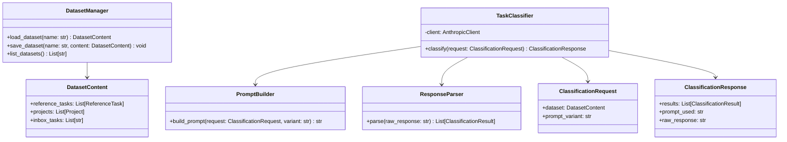

```mermaid
classDiagram
    class DatasetManager {
        +load_dataset(name: str) DatasetContent
        +save_dataset(name: str, content: DatasetContent) void
        +list_datasets() List[str]
    }
    
    class TaskClassifier {
        -client: AnthropicClient
        +classify(request: ClassificationRequest) ClassificationResponse
    }
    
    class PromptBuilder {
        +build_prompt(request: ClassificationRequest, variant: str) str
    }
    
    class ResponseParser {
        +parse(raw_response: str) List[ClassificationResult]
    }
    
    class DatasetContent {
        +reference_tasks: List[ReferenceTask]
        +projects: List[Project]
        +inbox_tasks: List[str]
    }
    
    class ClassificationRequest {
        +dataset: DatasetContent
        +prompt_variant: str
    }
    
    class ClassificationResponse {
        +results: List[ClassificationResult]
        +prompt_used: str
        +raw_response: str
    }
    
    TaskClassifier --> PromptBuilder
    TaskClassifier --> ResponseParser
    DatasetManager --> DatasetContent
    TaskClassifier --> ClassificationRequest
    TaskClassifier --> ClassificationResponse
```
