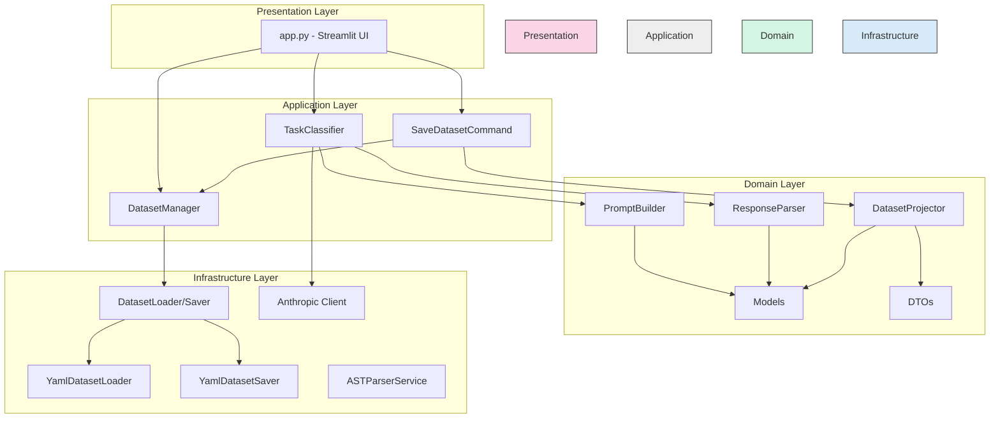

```mermaid
graph TD
    %% Define the layers
    subgraph "Presentation Layer"
        A[app.py - Streamlit UI]
    end

    subgraph "Application Layer"
        B[TaskClassifier]
        C[DatasetManager]
        D[SaveDatasetCommand]
    end

    subgraph "Domain Layer"
        E[Models]
        F[DTOs]
        G[PromptBuilder]
        H[ResponseParser]
        I[DatasetProjector]
    end

    subgraph "Infrastructure Layer"
        J[DatasetLoader/Saver]
        K[YamlDatasetLoader]
        L[YamlDatasetSaver]
        M[ASTParserService]
        N[Anthropic Client]
    end

    %% Define relationships between layers
    A --> B
    A --> C
    A --> D
    
    B --> G
    B --> H
    B --> N
    
    C --> J
    
    D --> C
    D --> I
    
    G --> E
    H --> E
    I --> E
    I --> F
    
    J --> K
    J --> L
    
    style Presentation fill:#f9d5e5,stroke:#333,stroke-width:1px
    style Application fill:#eeeeee,stroke:#333,stroke-width:1px
    style Domain fill:#d5f5e3,stroke:#333,stroke-width:1px
    style Infrastructure fill:#d6eaf8,stroke:#333,stroke-width:1px
```

```mermaid
classDiagram
    %% Core Models
    class Task {
        -properties
    }
    
    class Project {
        -properties
    }
    
    class DatasetContent {
        -properties
    }
    
    class ClassificationResult {
        -properties
    }
    
    class ClassificationRequest {
        -properties
    }
    
    class ClassificationResponse {
        -properties
    }
    
    %% DTOs
    class SaveDatasetRequest {
        +validate() Optional[str]
    }
    
    class SaveDatasetResponse {
        -properties
    }
    
    %% Dataset I/O
    class DatasetLoader {
        <<abstract>>
        +load(path: Path) DatasetContent
    }
    
    class DatasetSaver {
        <<abstract>>
        +save(path: Path, content: DatasetContent) None
    }
    
    class YamlDatasetLoader {
        +load(yaml_file: Path) DatasetContent
        -_parse_projects(projects_data: dict) List[Project]
        -_parse_tasks(tasks_data: List[dict]) List[Task]
    }
    
    class YamlDatasetSaver {
        +__init__()
        -_setup_yaml_representer()
        +save(dataset_path: Path, content: DatasetContent) None
        -_format_projects(projects: List[Project]) dict
        -_format_tasks(tasks: List[Task]) List[dict]
    }
    
    %% Services
    class DatasetManager {
        -base_path: Path
        +__init__(base_path: Path)
        +load_dataset(name: str) DatasetContent
        +save_dataset(name: str, content: DatasetContent) dict
        -_validate_dataset_name(name: str) str
        +list_datasets() List[str]
    }
    
    class PromptBuilder {
        -prompts_dir: Path
        +__init__(prompts_dir: Path)
        +build_prompt(request: ClassificationRequest) str
        -_is_static_prompt(variant: str) bool
        -_build_static_prompt(variant: str) str
        -_build_dynamic_prompt(request: ClassificationRequest) str
        -_get_dynamic_guidance(variant: str) str
        -_format_projects(projects: List[Project]) str
        -_format_inbox_tasks(tasks: List[str]) str
    }
    
    class ResponseParser {
        +parse(raw_response: str) List[ClassificationResult]
        -_parse_confidence(value: str) float
        -_create_result(task_data: dict) ClassificationResult
    }
    
    class TaskClassifier {
        -client
        -prompt_builder: PromptBuilder
        -parser: ResponseParser
        +__init__(client, prompt_builder: PromptBuilder, parser: ResponseParser)
        +classify(request: ClassificationRequest) ClassificationResponse
        -_call_api(prompt: str) str
    }
    
    class ASTParserService {
        +parse_default_value(node: ast.AST) DefaultValueResult
        +get_supported_node_types() List[str]
    }
    
    class SaveDatasetCommand {
        -dataset_manager: DatasetManager
        -projector: DatasetProjector
        +__init__(dataset_manager, projector)
        +execute(request: SaveDatasetRequest, source_dataset: DatasetContent) SaveDatasetResponse
    }
    
    class DatasetProjector {
        +from_ui_state(dataset: DatasetContent, name: str) SaveDatasetRequest
        +project_for_save(dataset: DatasetContent, request: SaveDatasetRequest) DatasetContent
    }
    
    %% Relationships
    DatasetLoader <|-- YamlDatasetLoader
    DatasetSaver <|-- YamlDatasetSaver
    
    DatasetContent o-- Project : contains
    DatasetContent o-- Task : contains
    Project o-- Task : contains
    
    ClassificationResponse o-- ClassificationResult : contains
    
    DatasetManager --> YamlDatasetLoader : uses
    DatasetManager --> YamlDatasetSaver : uses
    
    TaskClassifier --> PromptBuilder : uses
    TaskClassifier --> ResponseParser : uses
    
    SaveDatasetCommand --> DatasetManager : uses
    SaveDatasetCommand --> DatasetProjector : uses
    
    SaveDatasetRequest --> DatasetContent : references
    SaveDatasetResponse --> DatasetContent : references
```
