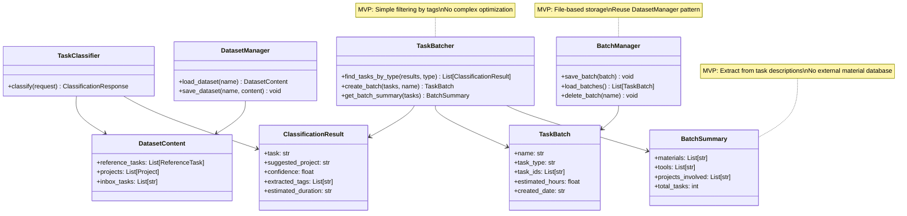

```mermaid
classDiagram
    %% Existing Core Classes (Keep as-is)
    class TaskClassifier {
        +classify(request) ClassificationResponse
    }
    
    class DatasetManager {
        +load_dataset(name) DatasetContent
        +save_dataset(name, content) void
    }
    
    %% MVP Batching Classes (Simplified)
    class TaskBatcher {
        +find_tasks_by_type(results, type) List[ClassificationResult]
        +create_batch(tasks, name) TaskBatch
        +get_batch_summary(tasks) BatchSummary
    }
    
    class BatchManager {
        +save_batch(batch) void
        +load_batches() List[TaskBatch]
        +delete_batch(name) void
    }
    
    %% Simplified Models (MVP Only)
    class TaskBatch {
        +name: str
        +task_type: str
        +task_ids: List[str]
        +estimated_hours: float
        +created_date: str
    }
    
    class BatchSummary {
        +materials: List[str]
        +tools: List[str]
        +projects_involved: List[str]
        +total_tasks: int
    }
    
    %% Existing Models (Reference only)
    class ClassificationResult {
        +task: str
        +suggested_project: str
        +confidence: float
        +extracted_tags: List[str]
        +estimated_duration: str
    }
    
    class DatasetContent {
        +reference_tasks: List[ReferenceTask]
        +projects: List[Project]
        +inbox_tasks: List[str]
    }
    
    %% Relationships (Simplified)
    TaskClassifier --> DatasetContent
    TaskClassifier --> ClassificationResult
    TaskBatcher --> ClassificationResult
    TaskBatcher --> TaskBatch
    TaskBatcher --> BatchSummary
    BatchManager --> TaskBatch
    DatasetManager --> DatasetContent
    
    %% Notes
    note for TaskBatcher "MVP: Simple filtering by tags\nNo complex optimization"
    note for BatchSummary "MVP: Extract from task descriptions\nNo external material database"
    note for BatchManager "MVP: File-based storage\nReuse DatasetManager pattern"
```