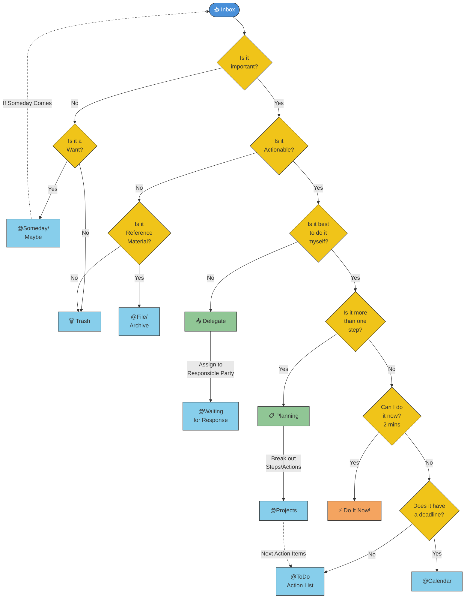

```mermaid

flowchart TD
    Inbox([📥 Inbox])
    
    Inbox --> Important{Is it<br/>important?}
    
    Important -->|No| Want{Is it a<br/>Want?}
    Want -->|Yes| Someday["@Someday/<br/>Maybe"]
    Want -->|No| Trash1[🗑️ Trash]
    
    Important -->|Yes| Actionable{Is it<br/>Actionable?}
    
    Actionable -->|No| Reference{Is it<br/>Reference<br/>Material?}
    Reference -->|No| Trash1
    Reference -->|Yes| File["@File/<br/>Archive"]
    
    Actionable -->|Yes| Myself{Is it best<br/>to do it<br/>myself?}
    
    Myself -->|No| Delegate[📤 Delegate]
    Delegate -->|Assign to<br/>Responsible Party| Waiting["@Waiting<br/>for Response"]
    
    Myself -->|Yes| MultiStep{Is it more<br/>than one<br/>step?}
    
    MultiStep -->|Yes| Planning[📋 Planning]
    Planning -->|Break out<br/>Steps/Actions| Projects["@Projects"]
    
    MultiStep -->|No| TwoMin{Can I do<br/>it now?<br/>2 mins}
    
    TwoMin -->|Yes| DoIt[⚡ Do It Now!]
    
    TwoMin -->|No| Deadline{Does it have<br/>a deadline?}
    
    Deadline -->|No| ToDo["@ToDo<br/>Action List"]
    Deadline -->|Yes| Calendar["@Calendar"]
    
    Projects -.->|Next Action Items| ToDo
    
    Someday -.->|If Someday Comes| Inbox

    style Inbox fill:#4a90d9,stroke:#333,color:#fff
    style Important fill:#f0c419,stroke:#333
    style Want fill:#f0c419,stroke:#333
    style Actionable fill:#f0c419,stroke:#333
    style Reference fill:#f0c419,stroke:#333
    style Myself fill:#f0c419,stroke:#333
    style MultiStep fill:#f0c419,stroke:#333
    style TwoMin fill:#f0c419,stroke:#333
    style Deadline fill:#f0c419,stroke:#333
    style Trash1 fill:#87ceeb,stroke:#333
    style Delegate fill:#90c695,stroke:#333
    style Planning fill:#90c695,stroke:#333
    style DoIt fill:#f4a460,stroke:#333
    style Someday fill:#87ceeb,stroke:#333
    style File fill:#87ceeb,stroke:#333
    style Waiting fill:#87ceeb,stroke:#333
    style Projects fill:#87ceeb,stroke:#333
    style ToDo fill:#87ceeb,stroke:#333
    style Calendar fill:#87ceeb,stroke:#333
```