# System Context: AI-Powered GTD

## Architecture: Model-View-Service (MVS)
We follow a **Unidirectional Data Flow** tailored for Streamlit's rerun cycle.

### 1. The View Layer (Ephemeral)
*   **Responsibility:** Renders the UI based *strictly* on the current Session State.
*   **Constraint:** Views are idempotent. They do not hold logic.
*   **Polymorphism:** Views use a `render_item(item)` strategy to draw the correct card (Checkbox vs. Shopping Row) based on the item's `kind`.

### 2. The Service Layer (Stable)
*   **Responsibility:** Handles business logic, AI communication, and State mutation.
*   **Components:**
    *   `TriageService`: Manages the Inbox, AI Classification, and Proposal Engine.
    *   `PlanningService`: Manages Goals, Project structures, and Ordering.
    *   `ExecutionService`: Manages Task completion and Context filtering.
    *   `AnalyticsService`: Manages "Chat with Data" (Smart Context) and Strategic Reviews.

### 3. The State Layer (The Bridge)
*   **Responsibility:** Holds the data between reruns.
*   **Key Flags:**
    *   `st.session_state.data`: The loaded `DatasetContent`.
    *   `st.session_state.is_dirty`: Boolean flag indicating unsaved changes.
    *   `st.session_state.current_draft`: The active AI suggestion waiting for user confirmation.
    *   `st.session_state.smart_results`: Cached results from the AI Coach.
    *   `st.session_state.smart_debug`: Raw prompt/response logs for the AI Coach.
## Data Persistence
*   **Format:** YAML.
*   **Strategy:** Explicit Save. The user must click "Save" to flush the `is_dirty` state to disk.

## High-Level System Architecture

```mermaid
graph LR
    subgraph "Presentation Layer"
        UI[🎨 Streamlit UI]
        TV[📥 Triage View]
        PV[📋 Planning View]
        EV[✅ Execution View]
        SV[🛒 Shopping View]
        CV[🎯 Coach View]
    end
    
    subgraph "Application Layer"
        TS[📨 Triage Service]
        PS[📊 Planning Service]
        ES[⚡ Execution Service]
        AS[🤖 Analytics Service]
        TC[🧠 Task Classifier]
        PB[📝 Prompt Builder]
    end
    
    subgraph "Domain Layer"
        REP[💾 YAML Repository]
        DM[📂 Dataset Manager]
        CMD[⚙️ Commands]
        PROJ[🔄 Projectors]
    end
    
    subgraph "Data Layer"
        YAML[(📄 YAML Files)]
        MODELS[📦 Domain Models]
    end
    
    subgraph "External Services"
        CLAUDE[🤖 Anthropic Claude API]
    end
    
    UI --> TV & PV & EV & SV & CV
    TV --> TS --> REP
    PV --> PS --> REP
    EV --> ES --> REP
    SV --> ES
    CV --> AS --> REP
    
    TS & PS & AS --> TC --> PB
    TC --> CLAUDE
    AS --> PB
    
    REP --> DM
    REP --> CMD
    CMD --> PROJ
    DM --> YAML
    REP --> MODELS
    
    style UI fill:#ff6b6b,stroke:#c92a2a,color:#fff
    style TV fill:#4ecdc4,stroke:#0a9396,color:#fff
    style PV fill:#4ecdc4,stroke:#0a9396,color:#fff
    style EV fill:#4ecdc4,stroke:#0a9396,color:#fff
    style SV fill:#4ecdc4,stroke:#0a9396,color:#fff
    style CV fill:#4ecdc4,stroke:#0a9396,color:#fff
    style TS fill:#95e1d3,stroke:#38a3a5
    style PS fill:#95e1d3,stroke:#38a3a5
    style ES fill:#95e1d3,stroke:#38a3a5
    style AS fill:#95e1d3,stroke:#38a3a5
    style TC fill:#f9ca24,stroke:#f0932b
    style PB fill:#f9ca24,stroke:#f0932b
    style REP fill:#a29bfe,stroke:#6c5ce7,color:#fff
    style DM fill:#a29bfe,stroke:#6c5ce7,color:#fff
    style CMD fill:#a29bfe,stroke:#6c5ce7,color:#fff
    style PROJ fill:#a29bfe,stroke:#6c5ce7,color:#fff
    style YAML fill:#74b9ff,stroke:#0984e3,color:#fff
    style MODELS fill:#74b9ff,stroke:#0984e3,color:#fff
    style CLAUDE fill:#fd79a8,stroke:#e84393,color:#fff
```

## Data Model Architecture

```mermaid
graph TD
    subgraph "Core Entities"
        DC[📦 DatasetContent<br/>Root Container]
        G[🎯 Goal<br/>High-level objectives]
        P[📁 Project<br/>Collection of items]
        PI[📋 ProjectItem<br/>Abstract Base]
    end
    
    subgraph "Item Types (Polymorphic)"
        T[✅ TaskItem<br/>done, context, next_action]
        R[🛒 ResourceItem<br/>acquired, store, type]
        REF[📚 ReferenceItem<br/>tags, description]
    end
    
    subgraph "Supporting Models"
        SC[⚙️ SystemConfig<br/>Inbox, settings]
        PS[📊 ProjectStatus<br/>ENUM: active/incubate]
        GS[🎯 GoalStatus<br/>ENUM: active/completed]
        RT[🏷️ ResourceType<br/>ENUM: food/tool/book]
    end
    
    DC -->|contains| G
    DC -->|contains| P
    DC -->|contains| SC
    G -->|links to| P
    P -->|contains| PI
    PI -.->|implements| T
    PI -.->|implements| R
    PI -.->|implements| REF
    P -->|has status| PS
    G -->|has status| GS
    R -->|has type| RT
    
    style DC fill:#ff6b6b,stroke:#c92a2a,color:#fff
    style G fill:#4ecdc4,stroke:#0a9396,color:#fff
    style P fill:#4ecdc4,stroke:#0a9396,color:#fff
    style PI fill:#95e1d3,stroke:#38a3a5
    style T fill:#f9ca24,stroke:#f0932b
    style R fill:#f9ca24,stroke:#f0932b
    style REF fill:#f9ca24,stroke:#f0932b
    style SC fill:#a29bfe,stroke:#6c5ce7,color:#fff
    style PS fill:#74b9ff,stroke:#0984e3,color:#fff
    style GS fill:#74b9ff,stroke:#0984e3,color:#fff
    style RT fill:#74b9ff,stroke:#0984e3,color:#fff
```

## Dependency Injection Pattern

## GTD Workflow State Machine

```mermaid
stateDiagram-v2
    [*] --> Inbox: 📥 Capture
    
    Inbox --> Classifying: 🤖 AI Analyze
    
    Classifying --> Draft: 📝 Generate Draft
    
    Draft --> ActionableTask: ✅ Is Actionable
    Draft --> Shopping: 🛒 Is Resource
    Draft --> Reference: 📚 Is Info
    Draft --> Incubate: 💤 Maybe Later
    Draft --> Trash: 🗑️ Not Useful
    
    ActionableTask --> ProjectActive: 📁 Assign to Project
    Shopping --> ProjectActive: 📁 Assign to Project
    Reference --> ProjectActive: 📁 Assign to Project
    
    ProjectActive --> NextAction: ⚡ Mark as Next Action
    NextAction --> InProgress: 🏃 Start Working
    InProgress --> Completed: ✅ Mark Done
    
    Incubate --> ProjectIncubated: 💤 Future Review
    ProjectIncubated --> ProjectActive: 🔄 Reactivate
    
    Completed --> [*]
    Trash --> [*]
    
    note right of Classifying
        AI determines:
        - Project assignment
        - Item type
        - Tags/context
        - Priority hints
    end note
    
    note right of ProjectActive
        Can contain:
        - Tasks
        - Resources
        - References
    end note
```

```mermaid
stateDiagram-v2
    [*] --> OpenApp: 🚀 Launch App
    
    OpenApp --> SelectDataset: 📂 Choose/Create Dataset
    
    SelectDataset --> TriageView: 📥 Capture Phase
    
    TriageView --> InboxEmpty: Check Inbox
    
    InboxEmpty --> AddItems: ➕ Add New Items
    AddItems --> ClassifyItem: 🤖 AI Classification
    ClassifyItem --> ReviewDraft: 👁️ Review Suggestion
    ReviewDraft --> ApplyDraft: ✅ Accept
    ReviewDraft --> ModifyDraft: ✏️ Modify
    ModifyDraft --> ApplyDraft
    ApplyDraft --> InboxEmpty: ➡️ Next Item
    
    InboxEmpty --> PlanningView: All Items Triaged
    
    PlanningView --> OrganizeGoals: 🎯 Set Goals
    OrganizeGoals --> LinkProjects: 🔗 Link Projects
    LinkProjects --> AddDetails: ➕ Add Tasks/Resources
    AddDetails --> EnrichAI: 🤖 AI Enrich (Optional)
    EnrichAI --> PlanComplete: 📋 Plan Ready
    
    PlanComplete --> ExecutionView: ⚡ Execute Phase
    
    ExecutionView --> FilterContext: 🔍 Filter by Context
    FilterContext --> SelectNextAction: ✅ Choose Next Action
    SelectNextAction --> WorkOnTask: 🏃 Do Work
    WorkOnTask --> CompleteTask: ✅ Mark Complete
    CompleteTask --> FilterContext: ➡️ Next Action
    
    ExecutionView --> ShoppingView: 🛒 Need to Shop?
    ShoppingView --> ViewByStore: 🏪 Group by Store
    ViewByStore --> MarkAcquired: ✅ Mark Bought
    MarkAcquired --> ShoppingView
    
    ExecutionView --> CoachView: 🎯 Get Insights?
    CoachView --> SmartFilter: 🔍 Query Tasks
    SmartFilter --> ViewAnalytics: 📊 See Reports
    ViewAnalytics --> GetRecommendations: 💡 AI Suggestions
    
    GetRecommendations --> ExecutionView: 🔄 Back to Work
    ShoppingView --> ExecutionView: 🔄 Back to Work
    
    ExecutionView --> SaveDataset: 💾 Save Progress
    SaveDataset --> [*]: 👋 Exit App
    
    note right of ClassifyItem
        AI analyzes:
        - Full project tree
        - Existing tags
        - Item semantics
        Returns:
        - Suggested project
        - Item type
        - Metadata
    end note
    
    note right of EnrichAI
        AI generates:
        - Related tasks
        - Required resources
        - Helpful references
    end note
    
    note right of SmartFilter
        Natural language:
        "Show urgent tasks
        related to work"
    end note
```

