# System Context: AI-Powered GTD

## Architecture: Model-View-Service (MVS)
We follow a **Unidirectional Data Flow** tailored for Streamlit's rerun cycle.

### 1. The View Layer (Ephemeral)
*   **Responsibility:** Renders the UI based *strictly* on the current Session State.
*   **Constraint:** Views are idempotent. They do not hold logic.
*   **Polymorphism:** Views use a `render_item(item)` strategy to draw the correct card based on the item's `kind`.

### 2. The Service Layer (Stable & Smart)
*   **Responsibility:** Handles business logic, AI communication, State mutation, and **Context Calculation**.
*   **Key Principle (SSOT):** Services are the Single Source of Truth for "What tags are available?"
    *   `TriageService`: Calculates **Global Context** (All Domains + All DB Tags).
    *   `PlanningService`: Calculates **Local Context** (Project Domain + Project Tags).
    *   `ExecutionService`: Manages Task completion and Context filtering.
    *   `AnalyticsService`: Manages "Chat with Data" (Smart Context) and Strategic Reviews.

### 3. The State Layer (The Bridge)
*   **Responsibility:** Holds the data between reruns.
*   **Key Flags:**
    *   `st.session_state.data`: The loaded `DatasetContent`.
    *   `st.session_state.is_dirty`: Boolean flag indicating unsaved changes.
    *   `st.session_state.current_draft`: The active AI suggestion waiting for user confirmation.

## Data Persistence
*   **Format:** YAML.
*   **Strategy:** Explicit Save. The user must click "Save" to flush the `is_dirty` state to disk.

## High-Level System Architecture

## Data Model Architecture

```mermaid
graph TD
    subgraph "Core Entities"
        DC[📦 DatasetContent]
        G[🎯 Goal]
        P[📁 Project]
        PI[📋 ProjectItem - Abstract Base]
    end
    
    subgraph "Context & Config"
        SC[⚙️ SystemConfig<br/>Durations SSOT]
        DT[🌍 DomainType<br/>Enum: Software, Maker...]
        DCFG[📖 DomainConfigs<br/>Tag Vocabularies]
    end
    
    subgraph "Item Types (Polymorphic)"
        T[✅ TaskItem]
        R[🛒 ResourceItem]
        REF[📚 ReferenceItem]
    end
    
    DC -->|contains| G
    DC -->|contains| P
    
    G -->|has domain| DT
    P -->|has domain| DT
    DT -.->|configures| DCFG
    
    P -->|contains| PI
    PI -->|has tags| T
    PI -.->|implements| T
    PI -.->|implements| R
    PI -.->|implements| REF
    P -->|has status| PS
    G -->|has status| GS
    R -->|has type| RT
    
    style DC fill:#ff6b6b,stroke:#c92a2a,color:#fff
    style G fill:#4ecdc4,stroke:#0a9396,color:#fff
    style P fill:#4ecdc4,stroke:#0a9396,color:#fff
    style PI fill:#95e1d3,stroke:#38a3a5
    style T fill:#f9ca24,stroke:#f0932b
    style R fill:#f9ca24,stroke:#f0932b
    style REF fill:#f9ca24,stroke:#f0932b
    style SC fill:#a29bfe,stroke:#6c5ce7,color:#fff
    style PS fill:#74b9ff,stroke:#0984e3,color:#fff
    style GS fill:#74b9ff,stroke:#0984e3,color:#fff
    style RT fill:#74b9ff,stroke:#0984e3,color:#fff
```

## Dependency Injection Pattern

## GTD Workflow State Machine

```mermaid
stateDiagram-v2
    [*] --> OpenApp: 🚀 Launch App
    
    OpenApp --> SelectDataset: 📂 Choose/Create Dataset
    
    SelectDataset --> TriageView: 📥 Capture Phase
    
    TriageView --> InboxEmpty: Check Inbox
    
    InboxEmpty --> AddItems: ➕ Add New Items
    AddItems --> ClassifyItem: 🤖 AI Classification
    ClassifyItem --> ReviewDraft: 👁️ Review Suggestion
    ReviewDraft --> ApplyDraft: ✅ Accept
    ReviewDraft --> ModifyDraft: ✏️ Modify
    ModifyDraft --> ApplyDraft
    ApplyDraft --> InboxEmpty: ➡️ Next Item
    
    InboxEmpty --> PlanningView: All Items Triaged
    
    PlanningView --> OrganizeGoals: 🎯 Set Goals
    OrganizeGoals --> LinkProjects: 🔗 Link Projects
    LinkProjects --> AddDetails: ➕ Add Tasks/Resources
    AddDetails --> EnrichAI: 🤖 AI Enrich (Optional)
    EnrichAI --> PlanComplete: 📋 Plan Ready
    
    PlanComplete --> ExecutionView: ⚡ Execute Phase
    
    ExecutionView --> FilterContext: 🔍 Filter by Context
    FilterContext --> SelectNextAction: ✅ Choose Next Action
    SelectNextAction --> WorkOnTask: 🏃 Do Work
    WorkOnTask --> CompleteTask: ✅ Mark Complete
    CompleteTask --> FilterContext: ➡️ Next Action
    
    ExecutionView --> ShoppingView: 🛒 Need to Shop?
    ShoppingView --> ViewByStore: 🏪 Group by Store
    ViewByStore --> MarkAcquired: ✅ Mark Bought
    MarkAcquired --> ShoppingView
    
    ExecutionView --> CoachView: 🎯 Get Insights?
    CoachView --> SmartFilter: 🔍 Query Tasks
    SmartFilter --> ViewAnalytics: 📊 See Reports
    ViewAnalytics --> GetRecommendations: 💡 AI Suggestions
    
    GetRecommendations --> ExecutionView: 🔄 Back to Work
    ShoppingView --> ExecutionView: 🔄 Back to Work
    
    ExecutionView --> SaveDataset: 💾 Save Progress
    SaveDataset --> [*]: 👋 Exit App
    
    note right of ClassifyItem
        AI analyzes:
        - Full project tree
        - Existing tags
        - Item semantics
        Returns:
        - Suggested project
        - Item type
        - Metadata
    end note
    
    note right of EnrichAI
        AI generates:
        - Related tasks
        - Required resources
        - Helpful references
    end note
    
    note right of SmartFilter
        Natural language:
        "Show urgent tasks
        related to work"
    end note
```

