# Feature F-01: Capture & Clarify (Inbox Mode)

## Value Proposition
To empty the user's brain into a trusted system and rapidly process vague thoughts into concrete items using AI.

## User Stories
*   **US-1.1 Quick Capture:** As a user, I can add a raw text string to the Inbox from any screen.
*   **US-1.2 AI Triage (Proposal Engine):** As a user, I want the AI to analyze an inbox item against my **Goals and Projects hierarchy** and propose a Draft containing:
    *   **Type:** Task, Resource (Shopping), Reference, or New Project.
    *   **Target:** The specific Project it belongs to.
    *   **Metadata:** Estimated duration and tags.
*   **US-1.3 One-Touch Processing:** As a user, I want to accept the AI proposal with a single click to create the concrete entity.

## UI Components
*   **Inbox Counter:** "5 items remaining"
*   **Proposal Card:** The central card showing the current item, the AI's reasoning, and the proposed classification.

```mermaid

stateDiagram-v2
    direction LR

    %% --- Initial State ---
    [*] --> Inbox : User Captures
    state "📥 Inbox Item" as Inbox

    %% --- The AI Processing Black Box ---
    state "🤖 AI Analysis" as AI_Process {
        state "Parse Text" as Parse
        state "Check Context" as Context
        state "Determine Type" as Type
        
        Parse --> Context
        Context --> Type
        
        note right of Type
            AI decides:
            1. Is it Actionable?
            2. Is it Multi-step?
        end note
    }

    Inbox --> AI_Process : Auto-Trigger

    %% --- The User Interface State (The Proposal) ---
    state "📝 Draft Proposal" as Proposal {
        state "AI Suggestion" as Suggestion
        
        note right of Suggestion
            AI Proposes:
            - Task
            - Project
            - Reference
            - Incubate
            (NEVER Trash)
        end note
    }

    AI_Process --> Proposal : Returns Result

    %% --- The Decision Fork ---
    state "User Decision" as Decision <<choice>>
    
    Proposal --> Decision : User Reviews

    %% --- Outcomes ---
    state "✅ Active System" as System {
        state "⚡ Next Action" as Task
        state "📂 Project" as Project
        state "📚 Reference" as Ref
        state "💤 Incubate" as Someday
    }

    state "🗑️ Trash" as Trash

    %% --- Transitions & Logic ---
    
    %% 1. Happy Path (AI was right)
    Decision --> System : 🤖 User Confirms AI
    
    %% 2. Override Path (AI was wrong/incomplete)
    Decision --> System : 🔄 User Overrides\n(Manual Edit)

    %% 3. The Manual Only Path
    Decision --> Trash : 👤 User Deletes\n(Manual Only)

    %% --- Styling ---
    classDef ai fill:#e1f5fe,stroke:#01579b,stroke-width:2px;
    classDef user fill:#e8f5e9,stroke:#2e7d32,stroke-width:2px;
    classDef manual fill:#ffebee,stroke:#c62828,stroke-width:2px,stroke-dasharray: 5 5;

    class AI_Process,Suggestion ai
    class System,Task,Project,Ref,Someday user
    class Trash manual
```

