# Feature F-01: Capture & Clarify (Inbox Mode)

## Value Proposition
To empty the user's brain into a trusted system and rapidly process vague thoughts into concrete items using AI, while retaining full user control over the final data quality.

## User Stories
*   **US-1.1 Quick Capture:** As a user, I can add a raw text string to the Inbox from any screen.
*   **US-1.2 AI Triage (Proposal Engine):** As a user, I want the AI to analyze an inbox item against my **Goals and Projects hierarchy** and propose a Draft containing:
    *   **Type:** Task, Resource (Shopping), Reference, Incubate (Someday), or New Project.
    *   **Target:** The specific Project it belongs to.
    *   **Refinement:** A cleaned-up, actionable title.
    *   **Metadata:** Estimated duration and context tags.
*   **US-1.3 One-Touch Processing:** As a user, I want to accept the AI proposal with a single click to create the concrete entity.
*   **US-1.4 Interactive Refinement:** As a user, I want to manually adjust the **Tags** and **Estimated Duration** of the proposal using standard options *before* confirming, so the data is clean from the start.

## UI Components
*   **Inbox Counter:** "5 items remaining"
*   **Proposal Card:** The central card showing the refined item, reasoning, interactive editors, and classification.

This analysis breaks down the functional and logical requirements of the **Inbox Triage View** based on the latest source code and requested changes.

Use this document as a **Product Requirement Specification (PRS)** when migrating to a frontend framework (React, Vue, Svelte, etc.).

---

# Triage View Specification

## 1. Core State Management
The view relies on a specific state machine to handle the asynchronous nature of AI processing and user interaction.

| State Variable | Description | Lifecycle |
| :--- | :--- | :--- |
| `inbox_queue` | List of raw strings waiting to be processed. | Fetched on mount. Updated on Add/Move/Delete. |
| `current_item` | The string at index 0 of the queue. | Derived from queue. |
| `draft_proposal` | The structured object returned by AI (or modified by user). | Created when `current_item` changes. Persists until action taken. |
| `is_processing` | Boolean flag for AI loading state. | True while fetching AI response. |
| `debug_data` | Raw prompt and JSON response. | Stored for the "Debug Info" panel. |

---

## 2. The Triage Loop (Logic Flow)

### A. Initialization
1.  Fetch `inbox_items` from the Store/Repository.
2.  If empty, show "Inbox Zero" success state.
3.  Calculate **Progress Bar**: `(Total Tasks - Inbox Count) / Total Tasks`.

### B. AI Analysis (The Proposal Engine)
*Trigger:* When `current_item` changes and no `draft_proposal` exists.

1.  **Context Assembly:**
    *   Build the **Hierarchy Tree** string (Goals -> Projects -> Active Tasks).
    *   Fetch **All Existing Tags** (Union of System Defaults + Tags used in DB).
2.  **Request:** Send `current_item` + `Hierarchy` + `Tags` to AI Service.
3.  **Response Parsing:** Receive structured JSON (`ClassificationResult`).
4.  **Draft Creation:** Instantiate a `DraftItem` containing the AI result.

---

## 3. UI Components & Interactions

### A. Quick Capture (Top)
*   **Component:** Collapsible Accordion / Input Field.
*   **Action:** User types text -> Hits Enter -> Item is appended to the **end** of `inbox_queue`.
*   **UX:** Does not interrupt the current triage session.

### B. The Proposal Card (Center)
This is the main workspace. It displays the `draft_proposal`.

1.  **Header:** Displays the `current_item` text.
2.  **Metadata Display:**
    *   **Type:** Icon + Label (e.g., ⚡ Task, 🛒 Resource, 💤 Incubate).
    *   **Project:** The suggested project name (or "Unmatched").
    *   **Reasoning:** The "Why" from the AI (displayed as a hint).
    *   **Duration:** Estimated time (if applicable).
3.  **Tag Editor (Critical Complexity):**
    *   **Widget:** Multi-select / Combobox.
    *   **Data Source:** Union of [System Defaults, Existing DB Tags, AI Suggested Tags].
    *   **Behavior:** Pre-filled with AI suggestions. User can add/remove tags.
    *   **State Sync:** Changes here must immediately update the `draft_proposal` object in memory so the "Confirm" action captures user edits.
    *   **Key Requirement:** Must reset completely when the item changes (avoid state leakage between tasks).

### C. Primary Actions (Toolbar)
Three distinct exit paths for the item.

| Button | Condition | Action |
| :--- | :--- | :--- |
| **✅ Confirm** | Project is matched | Converts Draft -> Entity. Adds to Project. Removes from Inbox. |
| **✅ Confirm** | Project is "Unmatched" | **Disabled/Warning.** User must select a project manually below. |
| **✅ Confirm** | Type is "New Project" | **Info Message.** Directs user to the "Create New Project" form below. |
| **⏭️ Skip** | Always enabled | Moves item to the **end** of the queue. Clears current draft. |
| **🗑️ Trash** | Always enabled | Permanently deletes item. Clears current draft. |

### D. Alternative Suggestions (Pills)
*   **Condition:** If AI provides `alternative_projects` list.
*   **UI:** Horizontal list of clickable chips/pills.
*   **Action:** Clicking a pill **immediately** moves the item to that project (bypassing the "Confirm" button).

---

## 4. Manual Overrides (The "Escape Hatches")

### A. Manual Project Assignment
*   **Component:** Searchable Dropdown (Select).
*   **Data:** List of all existing projects.
*   **Action:** Selecting a project + Clicking "Move" immediately assigns the item to that project (as a Task) and removes it from Inbox.

### B. Create New Project (Unified)
*   **Component:** Collapsible Form (Accordion).
*   **Auto-Expand Logic:** Automatically expands if AI classification is `NEW_PROJECT` **OR** if `suggested_project` is "Unmatched".
*   **Input Pre-fill:** The "Project Name" input is pre-filled with `result.suggested_new_project_name` (if available), regardless of the classification type.
*   **Action:** Creates a new Project entity -> Converts Inbox Item to a Task -> Moves Task to new Project.

---

## 5. Debugging
*   **Component:** Collapsible "Debug Info" section.
*   **Content:**
    1.  **Exact Prompt:** The markdown string sent to the LLM (crucial for checking context indentation).
    2.  **Raw Response:** The JSON received from the LLM.

---

## 6. Data Models (Types)

**Classification Types (Enum):**
*   `TASK` (Actionable)
*   `RESOURCE` (Shopping/Material)
*   `REFERENCE` (Read-only/Info)
*   `INCUBATE` (Someday/Maybe)
*   `NEW_PROJECT` (Multi-step)

**Draft Item (Object):**
*   `source_text`: String
*   `classification`: Object
    *   `type`: Enum
    *   `project`: String
    *   `tags`: Array[String]
    *   `reasoning`: String
    *   `duration`: String
    *   `new_project_name`: String

### B. The Proposal Card (Center)

1.  **Header:** 
    *   Displays the **Refined Text** (cleaned by AI).
    *   Shows original raw text as a caption if different.
2.  **Metadata Display:**
    *   **Type:** Icon + Label.
    *   **Project:** Suggested project name.
    *   **Reasoning:** AI explanation.
3.  **Tag Editor (Interactive):**
    *   **Widget:** Multi-select.
    *   **Behavior:** Pre-filled with AI tags. User can add/remove.
    *   **State:** Uses dynamic key to reset on new item. Updates Draft immediately.
4.  **Duration Editor (Interactive):**
    *   **Widget:** Selectbox.
    *   **Options:** Standard GTD times (5min, 15min, 30min, 1h, 2h, 4h, Day).
    *   **Behavior:** Pre-selected with AI estimate. User can override. Updates Draft immediately.

```mermaid

stateDiagram-v2
    direction LR

    %% --- Initial State ---
    [*] --> Inbox : User Captures
    state "📥 Inbox Item" as Inbox

    %% --- The AI Processing Black Box ---
    state "🤖 AI Analysis" as AI_Process {
        state "Parse Text" as Parse
        state "Check Context" as Context
        state "Determine Type" as Type
        
        Parse --> Context
        Context --> Type
        
        note right of Type
            AI decides:
            1. Is it Actionable?
            2. Is it Multi-step?
        end note
    }

    Inbox --> AI_Process : Auto-Trigger

    %% --- The User Interface State (The Proposal) ---
    state "📝 Draft Proposal" as Proposal {
        state "AI Suggestion" as Suggestion
        state "User Refinement" as Refine
        
        Suggestion --> Refine : Edit Tags/Time
        
        note right of Suggestion
            AI Proposes:
            - Task
            - Project
            - Reference
            - Incubate
            (NEVER Trash)
        end note
    }

    AI_Process --> Proposal : Returns Result

    %% --- The Decision Fork ---
    state "User Decision" as Decision <<choice>>
    
    Proposal --> Decision : User Reviews

    %% --- Outcomes ---
    state "✅ Active System" as System {
        state "⚡ Next Action" as Task
        state "📂 Project" as Project
        state "📚 Reference" as Ref
        state "💤 Incubate" as Someday
    }

    state "🗑️ Trash" as Trash

    %% --- Transitions & Logic ---
    
    %% 1. Happy Path (AI was right)
    Decision --> System : 🤖 User Confirms AI
    
    %% 2. Override Path (AI was wrong/incomplete)
    Decision --> System : 🔄 User Overrides\n(Manual Edit)

    %% 3. The Manual Only Path
    Decision --> Trash : 👤 User Deletes\n(Manual Only)

    %% --- Styling ---
    classDef ai fill:#e1f5fe,stroke:#01579b,stroke-width:2px;
    classDef user fill:#e8f5e9,stroke:#2e7d32,stroke-width:2px;
    classDef manual fill:#ffebee,stroke:#c62828,stroke-width:2px,stroke-dasharray: 5 5;

    class AI_Process,Suggestion ai
    class System,Task,Project,Ref,Someday user
    class Trash manual
```

