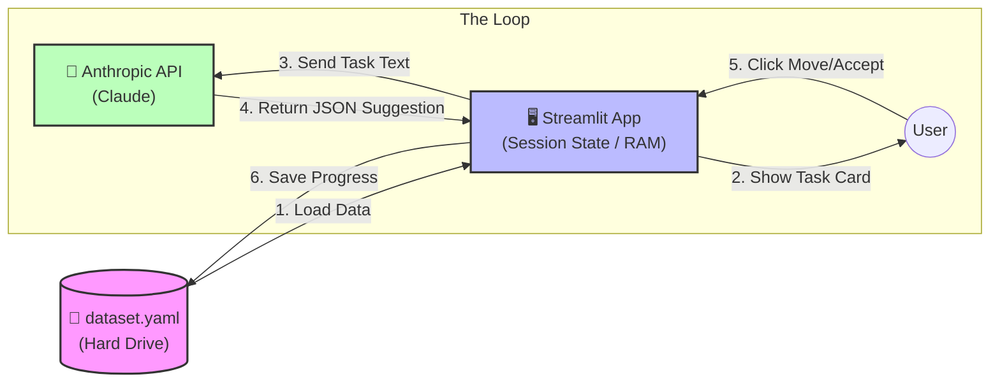

```mermaid
graph RL
    %% Nodes
    User((User))
    YAML[("📂 dataset.yaml\n(Hard Drive)")]
    App["🖥️ Streamlit App\n(Session State / RAM)"]
    AI["🤖 Anthropic API\n(Claude)"]
    
    %% Flow
    YAML -- "1. Load Data" --> App
    App -- "2. Show Task Card" --> User
    
    subgraph "The Loop"
        App -- "3. Send Task Text" --> AI
        AI -- "4. Return JSON Suggestion" --> App
        User -- "5. Click Move/Accept" --> App
    end
    
    App -- "6. Save Progress" --> YAML

    %% Styling
    style YAML fill:#f9f,stroke:#333,stroke-width:2px
    style App fill:#bbf,stroke:#333,stroke-width:2px
    style AI fill:#bfb,stroke:#333,stroke-width:2px
```
