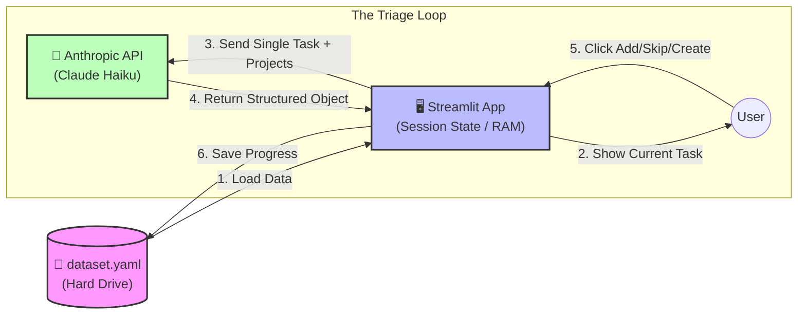
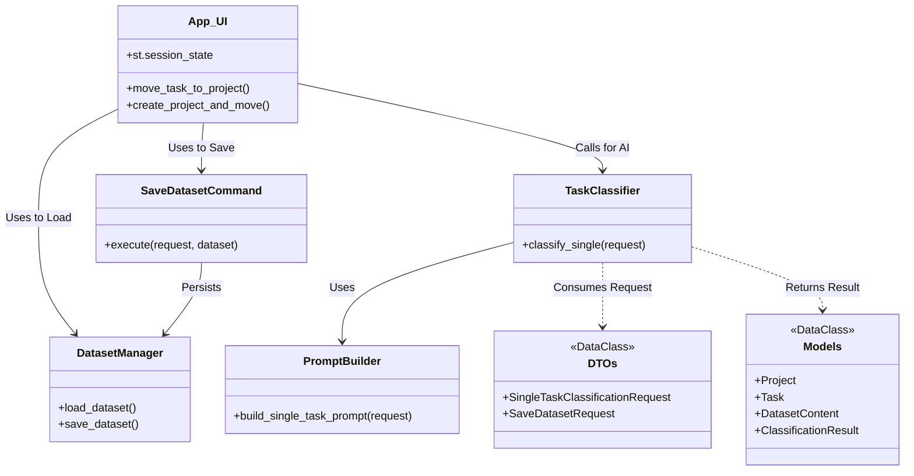
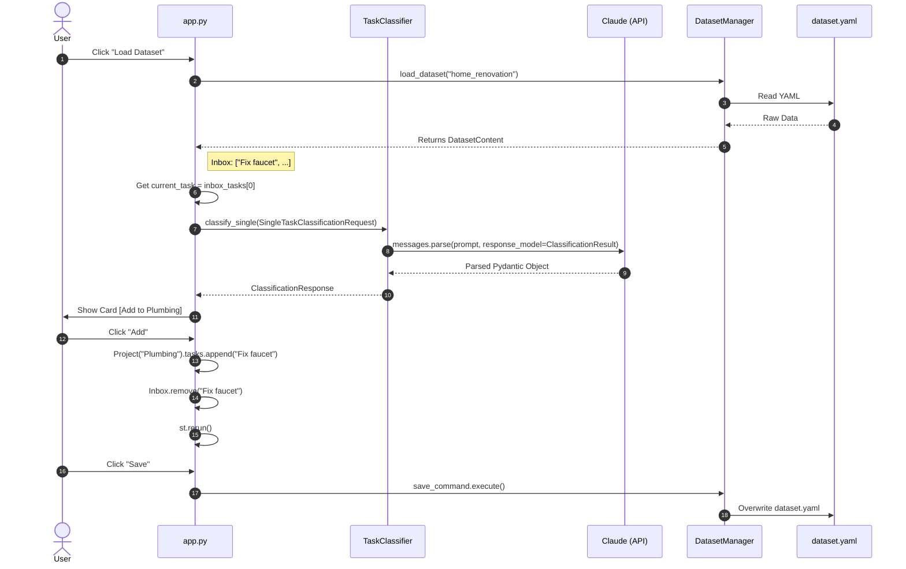
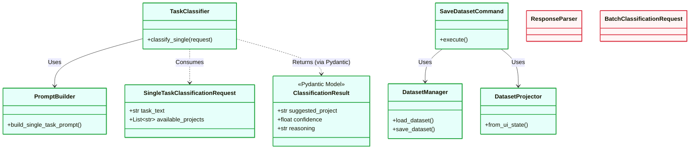

```mermaid
graph RL
    %% Nodes
    User((User))
    YAML[("📂 dataset.yaml\n(Hard Drive)")]
    App["🖥️ Streamlit App\n(Session State / RAM)"]
    AI["🤖 Anthropic API\n(Claude Haiku)"]
    
    %% Flow
    YAML -- "1. Load Data" --> App
    App -- "2. Show Current Task" --> User
    
    subgraph "The Triage Loop"
        App -- "3. Send Single Task + Projects" --> AI
        AI -- "4. Return Structured Object" --> App
        User -- "5. Click Add/Skip/Create" --> App
    end
    
    App -- "6. Save Progress" --> YAML

    %% Styling
    style YAML fill:#f9f,stroke:#333,stroke-width:2px
    style App fill:#bbf,stroke:#333,stroke-width:2px
    style AI fill:#bfb,stroke:#333,stroke-width:2px
```

```mermaid

classDiagram
    class App_UI {
        +st.session_state
        +move_task_to_project()
        +create_project_and_move()
    }

    class DatasetManager {
        +load_dataset()
        +save_dataset()
    }

    class TaskClassifier {
        +classify_single(request)
    }

    class PromptBuilder {
        +build_single_task_prompt(request)
    }

    class SaveDatasetCommand {
        +execute(request, dataset)
    }

    class Models {
        <<DataClass>>
        +Project
        +Task
        +DatasetContent
        +ClassificationResult
    }

    class DTOs {
        <<DataClass>>
        +SingleTaskClassificationRequest
        +SaveDatasetRequest
    }

    %% Relationships
    App_UI --> DatasetManager : Uses to Load
    App_UI --> SaveDatasetCommand : Uses to Save
    App_UI --> TaskClassifier : Calls for AI
    
    TaskClassifier --> PromptBuilder : Uses
    TaskClassifier ..> DTOs : Consumes Request
    TaskClassifier ..> Models : Returns Result
    
    SaveDatasetCommand --> DatasetManager : Persists
```

```mermaid

sequenceDiagram
    autonumber
    actor User
    participant UI as app.py
    participant TC as TaskClassifier
    participant AI as Claude (API)
    participant DM as DatasetManager
    participant Disk as dataset.yaml

    %% 1. Initialization
    User->>UI: Click "Load Dataset"
    UI->>DM: load_dataset("home_renovation")
    DM->>Disk: Read YAML
    Disk-->>DM: Raw Data
    DM-->>UI: Returns DatasetContent
    note right of UI: Inbox: ["Fix faucet", ...]

    %% 2. The Analysis Loop (Single Item)
    UI->>UI: Get current_task = inbox_tasks[0]
    UI->>TC: classify_single(SingleTaskClassificationRequest)
    TC->>AI: messages.parse(prompt, response_model=ClassificationResult)
    AI-->>TC: Parsed Pydantic Object
    TC-->>UI: ClassificationResponse
    UI->>User: Show Card [Add to Plumbing]

    %% 3. The Mutation (In-Memory)
    User->>UI: Click "Add"
    UI->>UI: Project("Plumbing").tasks.append("Fix faucet")
    UI->>UI: Inbox.remove("Fix faucet")
    UI->>UI: st.rerun()

    %% 4. Persistence
    User->>UI: Click "Save"
    UI->>DM: save_command.execute()
    DM->>Disk: Overwrite dataset.yaml
```

```mermaid

classDiagram
    %% --- ACTIVE CLASSES (Green) ---
    class DatasetManager {
        +load_dataset()
        +save_dataset()
    }

    class TaskClassifier {
        +classify_single(request)
    }

    class PromptBuilder {
        +build_single_task_prompt()
    }

    class SaveDatasetCommand {
        +execute()
    }

    class DatasetProjector {
        +from_ui_state()
    }

    class SingleTaskClassificationRequest {
        +str task_text
        +List~str~ available_projects
    }

    class ClassificationResult {
        <<Pydantic Model>>
        +str suggested_project
        +float confidence
        +str reasoning
    }

    %% --- REMOVED/UNUSED CLASSES (Red) ---
    class ResponseParser {
        %% Replaced by Anthropic Structured Outputs
    }

    class BatchClassificationRequest {
        %% Replaced by SingleTaskClassificationRequest
    }

    %% --- RELATIONSHIPS ---
    
    %% Active Flow
    TaskClassifier --> PromptBuilder : Uses
    TaskClassifier ..> SingleTaskClassificationRequest : Consumes
    TaskClassifier ..> ClassificationResult : Returns (via Pydantic)
    
    SaveDatasetCommand --> DatasetManager : Uses
    SaveDatasetCommand --> DatasetProjector : Uses

    %% --- STYLING ---
    style DatasetManager fill:#e6fffa,stroke:#28a745,stroke-width:2px
    style TaskClassifier fill:#e6fffa,stroke:#28a745,stroke-width:2px
    style PromptBuilder fill:#e6fffa,stroke:#28a745,stroke-width:2px
    style SaveDatasetCommand fill:#e6fffa,stroke:#28a745,stroke-width:2px
    style DatasetProjector fill:#e6fffa,stroke:#28a745,stroke-width:2px
    style SingleTaskClassificationRequest fill:#e6fffa,stroke:#28a745,stroke-width:2px
    style ClassificationResult fill:#e6fffa,stroke:#28a745,stroke-width:2px
    
    style ResponseParser fill:#fff5f5,stroke:#dc3545,stroke-width:2px
    style BatchClassificationRequest fill:#fff5f5,stroke:#dc3545,stroke-width:2px
```