## UI Layout & Navigation

### 1. The Sidebar (System Control)
The sidebar persists across all modes and handles the "Meta" application state.

*   **Dataset Selector:** A Dropdown menu listing files found in `./data/*.yaml`.
    *   *Options:* `home_renovation.yaml`, `coding_projects.yaml`, `test_edge_cases.yaml`.
*   **Status Indicator:**
    *   🟢 Saved
    *   🔴 Unsaved Changes (Dirty)
*   **Global Actions:**
    *   [Save Changes] (Enabled only when Dirty)
    *   [Reload/Revert] (Reloads from disk, discarding changes)

### 2. Main Content Area
Changes based on the selected Mode (Inbox / Planning / Engage).

```mermaid
graph RL
    %% Nodes
    User((User))
    YAML[("📂 dataset.yaml\n(Hard Drive)")]
    App["🖥️ Streamlit App\n(Session State)"]
    AI["🤖 Anthropic API\n(Claude Haiku)"]
    
    %% Flow
    YAML -- "1. Load Data" --> App
    App -- "2. Show Current Task" --> User
    
    subgraph "The Triage Loop"
        App -- "3. Send Task + Project List" --> AI
        AI -- "4. Return ClassificationResult\n(Type: Task/Shop/Ref)" --> App
        User -- "5. Add, Skip, Edit, Create project" --> App
    end
    
    App -- "6. Mutate Session State\n(Mark Dirty)" --> App
    User -- "7. Click Save" --> App
    App -- "8. Write to Disk" --> YAML

    %% Styling
    style YAML fill:#f9f,stroke:#333,stroke-width:2px
    style App fill:#bbf,stroke:#333,stroke-width:2px
    style AI fill:#bfb,stroke:#333,stroke-width:2px
```

